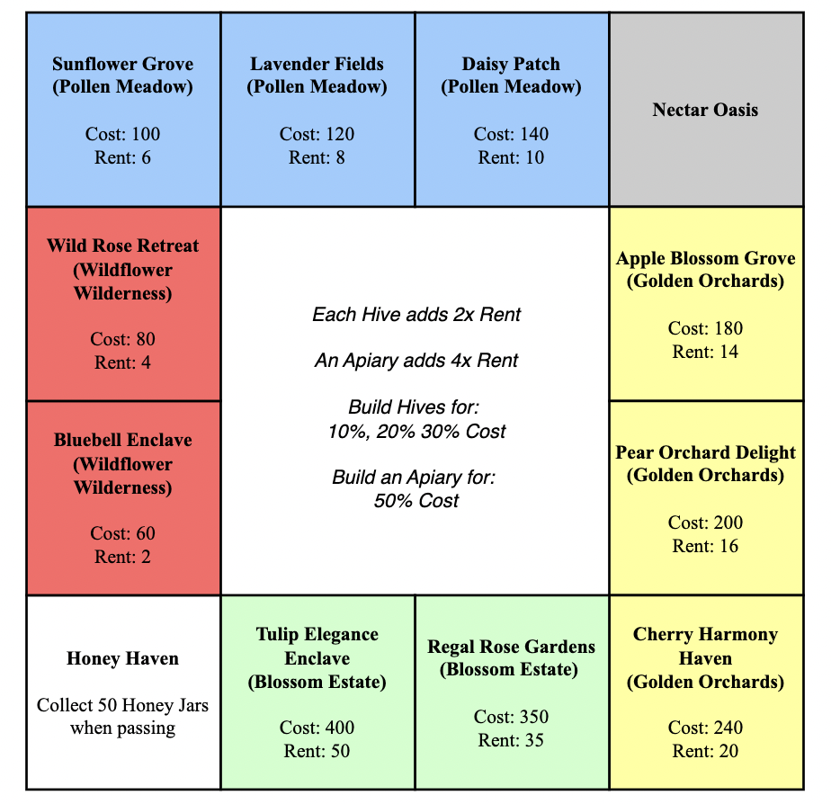

<h1>Beeopoly</h1>

<i>“If the bee disappeared off the surface of the globe, then man would only have four years of life left. No more bees, no more pollination, no more plants, no more animals, no more man.” </i>

Inspired by the above quote, which is often attributed to Albert Einstein, the decision was taken to develop a bee-themed version of Monopoly, i.e. “Beeopoly”. To reflect this theme, players take on the role of “beekeepers”, and “gardens”, which are grouped together into "fields”, replace the traditional properties on the Monopoly board. Instead of traditional currency, beekeepers accumulate and trade resources in the form of honey jars. Beekeepers must purchase all gardens in a particular field before they can strategically develop them by building hives (which replace houses) and apiaries (which replace hotels). The goal of each beekeeper is to cultivate an expansive network of habitats to safeguard and nurture bee populations, while avoiding exhausting their supply of honey jars, in which case they are eliminated from the game. The winning beekeeper is determined by the value of their empire at the conclusion of the game. 

**The image below should be used to visualise the game board**

  

